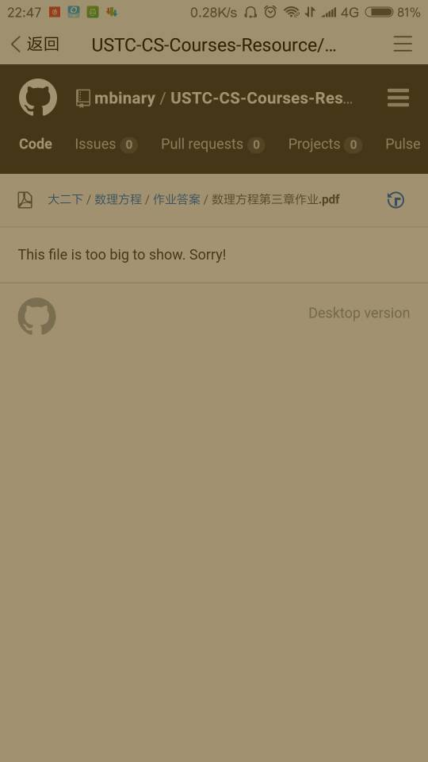

# USTC-CS-Courses-Resource
>这是一个收集 USTC-CS（也有较少的其他课程）的课程资源的 repo, 包括课程电子版书籍，参考书，ppt, 考试试卷，学习心得，某些书的答案。目的是为同学们，尤其是学弟学妹提供参考

# Table of Content
<!-- vim-markdown-toc GFM -->

* [公告](#公告)
* [文件浏览版](#文件浏览版)
* [贡献者名单](#贡献者名单)
* [课程结构](#课程结构)
* [课程目录](#课程目录)
* [管理与投稿](#管理与投稿)
    * [投稿方式](#投稿方式)
    * [投稿建议](#投稿建议)
    * [管理工作](#管理工作)
    * [管理要求](#管理要求)
* [版权声明](#版权声明)

<!-- vim-markdown-toc -->

# 公告
* 已初步整理了现有课程资源,整理工作包括将各文件按上述的课程结构分好类，删除一些不合适的资料（比如作业代码（欢迎非非作业代码）)
* 一些课程虽然在目录中，但是资源还是较少，不齐全，希望大家积极贡献
* 希望对这个项目感兴趣的同学帮忙宣传，有看法的同学提出建议（通过 [issue](https://github.com/mbinary/USTC-CS-Courses-Resource/issues/new),<a href="mailto:zhuheqin@mail.ustc.edu.cn?subject=%E5%8F%8D%E9%A6%88%E4%B8%8E%E5%BB%BA%E8%AE%AE">mail</a>, 或者 [qq](http://wpa.qq.com/msgrd?v=3&uin=414313516&site=qq&menu=yes))
* 如果其他学院的同学感兴趣，可以在 [ustc-courses](https://github.com/USTC-Courses/) 这个 org 中新建（先联系我加入 org) 属于其他学院的 repo, 管理与维护

# [文件浏览版](https://mbinary.coding.me/ustc-cs/)
做了[文件浏览版](https://mbinary.coding.me/ustc-cs/),可以进入点击下载资料.
可以解决github 的如下问题
* 慢
* 如果想下载二进制文件, 在github 需要点击两次(第一次显示`This file is binary and cannot be displayed inline`,需要再点`open binary file`/`Download`才行), 而在文件浏览版只需要一次即可下载
* 对于大的二进制文件, github 移动端的不能直接下载,如下, 需要切换成 `Desktop Version` 才有 下载按钮, 很麻烦.


# [贡献者名单](https://github.com/USTC-Courses/CS/graphs/contributors)


# 课程结构
每门课程大致结构如下，有些栏目可能没有，也可以自己添加认为合理的栏目
* PPT（若有多个老师，在 ppt 目录下新建各个老师的目录或者在课程目录建立ppt_teacherName1, ppt_teacherName2...）
* homework & lab（一个或两个目录）
* reference & textbook（这些可以不用新建目录，直接在课程目录下）
* 课程主页（记在 课程/README.md 中)
* 心得与经验
* students（同学们上传的自己的一些资料,作品，每个同学新建一个目录)
* 文件多于 3 个的目录下都有个 zip 文件：`.*?-- 等当前目录下的\d+个文件.zip`,包含当前目录下的所有文件, 这样方便同学们一键下载

如`数据结构`课程

```
.
├ lab
│   └ README.md
├ ppt
│   ├ ch3-- 等当前目录下的 8 个文件.zip
│   ├ ch3.ppt
│   ├ ch6.pps
│   ├ ch7.pps
│   ├ ch9.pps
│   ├ chapter1：绪论 (Ver1.0 3 学时）.ppt
│   ├ chapter2：线性表（Ver 0.5 8 学时）.ppt
│   ├ 数据结构 c 语言版严蔚敏 PPT.ppt
│   └ 第十章排序 2015.ppt
├ students
│   ├ mbinary
│   └ README.md
├ 数据结构 c_严蔚敏.pdf
└ 数据结构习题集答案 (C 语言版严蔚敏）_ca332.pdf
```


# 课程目录
```
    * [src](./src)
    * [书籍推荐](./书籍推荐)
    * [公选课](./公选课)
        * [交响乐赏析](./公选课/交响乐赏析)
        * [技术,财富与文明变迁](./公选课/技术,财富与文明变迁)
        * [物联网导论](./公选课/物联网导论)
        * [网络安全基础及应用](./公选课/网络安全基础及应用)
        * [计算机系统详解(csapp)](./公选课/计算机系统详解(csapp))
    * [大一下](./大一下)
        * [代数结构](./大一下/代数结构)
        * [程序设计2](./大一下/程序设计2)
        * [线性代数B1](./大一下/线性代数B1)
    * [大三上](./大三上)
        * [Web-信息处理与应用](./大三上/Web-信息处理与应用)
        * [密码学](./大三上/密码学)
        * [微机原理](./大三上/微机原理)
        * [程序设计语言基础(英)](./大三上/程序设计语言基础(英))
        * [算法基础](./大三上/算法基础)
        * [编译原理和技术(H)](./大三上/编译原理和技术(H))
        * [计算机网络](./大三上/计算机网络)
        * [随机过程](./大三上/随机过程)
    * [大三下](./大三下)
        * [计算方法](./大三下/计算方法)
    * [大二上](./大二上)
        * [ICS](./大二上/ICS)
        * [光学与原子物理](./大二上/光学与原子物理)
        * [数据结构](./大二上/数据结构)
        * [数电实验](./大二上/数电实验)
        * [魔术](./大二上/魔术)
    * [大二下](./大二下)
        * [osh](./大二下/osh)
        * [操作系统原理与设计](./大二下/操作系统原理与设计)
        * [数理方程](./大二下/数理方程)
        * [数理逻辑](./大二下/数理逻辑)
        * [概率论与数理统计B](./大二下/概率论与数理统计B)
        * [计算机组成原理](./大二下/计算机组成原理)
        * [运筹学基础](./大二下/运筹学基础)
        * [重要思想概论](./大二下/重要思想概论)
    * [自由选修-信息类](./自由选修-信息类)
    * [自由选修-数学类](./自由选修-数学类)
    * [自由选修-物理类](./自由选修-物理类)
    * [自由选修-经管类](./自由选修-经管类)
        * [会计学原理](./自由选修-经管类/会计学原理)
        * [微观经济学](./自由选修-经管类/微观经济学)
```


# 管理与投稿
非常欢迎大家的参与与贡献

## 投稿方式

* 发给管理员帮忙上传

* 用网页或者[桌面版](https://desktop.github.com/)直接操作，fork and pull request, 
   操作方式可以参考 [这里](https://blog.csdn.net/qq_29277155/article/details/51048990)和[这里](https://blog.csdn.net/zhangw0_0/article/details/50667891)

* 用命令行的 git  fork and pull request

对于用命令行的同学,提醒一下这个仓库很大（2018-5-2时已有 3G左右）
所以如果直接 clone 很慢。
可以使用 sparse-checkout, 只下载你指定的目录

首先用网页操作，创建你想要的目录（已有的可以直接用）, 如在公选课目录下创建`人工智障`,
然后在 cli 执行
```shell
mkdir ustc-courses  #文件夹名可以自己取
cd ustc-courses
git init
git remote add -f origin  git@github.com:mbinary/USTC-CS-Courses-Resource.git
git config core.sparsecheckout true
echo "公选课/人工智障"  >> .git/info/sparse-checkout  #这里工作目录就是在那个 repo 主页下

#如果还有其他目录，都像上面一样加入即可，如 `echo  "大二上/ICS/ppt" >> .git/info/sparse-checkout`
#只需记住的是 加入的目录应该在远程仓库存在，否则报错“error: Sparse checkout leaves no entry on the working directory”

git pull origin master
```


## 投稿建议
* 由于 github 上不能直接上传大于 100mb 的文件，所以就不要上传太大的文件。可以存在云盘，然后将云盘链接发在这里。
* 若是自己原创的作品，可以在文件名后加上后缀，如`-16- 计 - 王小二`, 文件里也可以写上联系方式，当然不写也行。

## 管理工作

* 帮忙上传文件
* 将各种资源分好类，放在对应的目录中
* 检查一些文件是否合适，比如删除作业代码，（欢迎非作业代码）
* 注意资源大多是二进制文件, 多次改动会使git重新上传, 即使mv, 也会使本地仓库重新上传到远程仓库,所以在没有必要的情况下, 不要对二进制文件做任何改动.

## 管理要求
若想帮忙管理 (collaborator), 请联系我


非常感谢你的参与与贡献，希望你有责任，有耐心，乐于奉献.


# 版权声明
所有资源，著作权归原作者所有，此 repo 的目的是**学习交流**.
如果使用者的不当使用造成不良后果，与此 repo 的贡献者无关。

