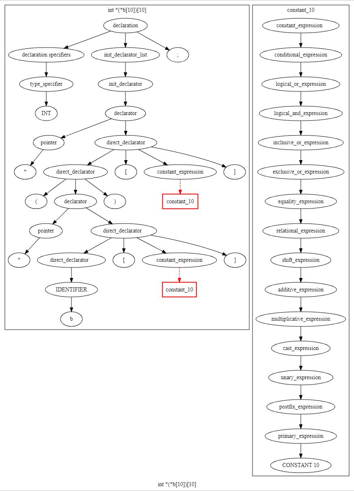

# 
编译原理作业三
**
PB16030899-朱河勤 
**

# C 语言运算符优先级
`注:优先级越大, 越优先`

优先级|算符|结合性
:-:|:-|:-:
1|逗号,|左
2| 赋值|右
3| 条件?:|右
4|逻辑或 \|\||左
5|逻辑与&&|左
6|位或 \||左
7|位取反^|左
8|位与异&|左
9|等于 =,!=|左
10|关系>,<,<=,>=|左
11|移位>>,<<|左
12|加减 +,-|左
13|乘除 *,/,%|左
14|类型转换|右
15|单目 &,*,+,-,~,!|右

# 语法分析树
